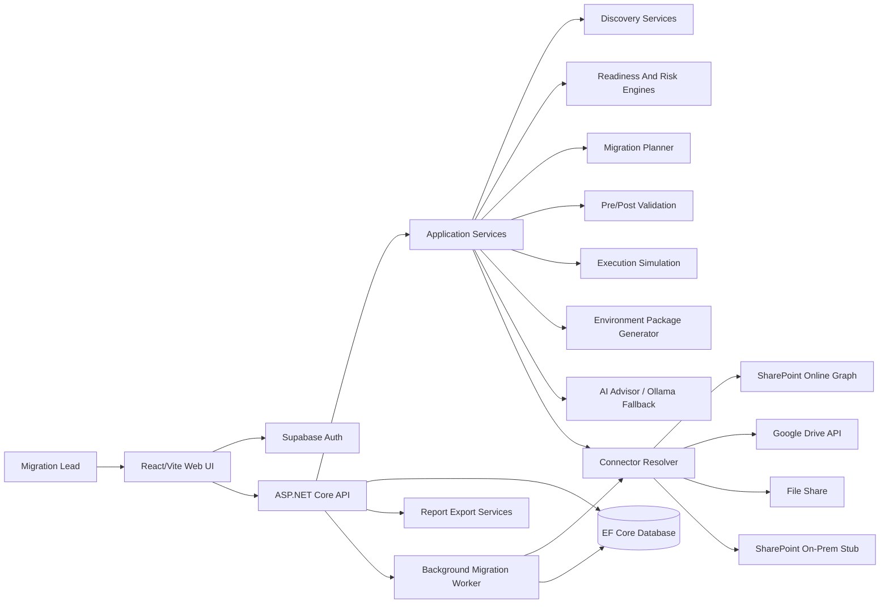

# ZMS Architecture Diagram

## High-Level Architecture

## Main Layers

| Layer | Responsibility |
| --- | --- |
| React/Vite UI | Authenticated operator workflow, dashboards, forms, reports, planning views |
| ASP.NET Core API | API endpoints, auth enforcement, CORS, startup, controllers |
| Application services | Discovery, readiness, planning, validation, simulation, AI, package generation |
| Infrastructure | EF Core persistence, repositories, Data Protection key storage |
| Migration engine | Background job processing, retries, state transitions, timelines |
| Connectors | File Share, Google Drive, SharePoint Online, SharePoint On-Prem stub |
| Reporting | CSV/JSON/Markdown exports and generated artifacts |

## Current Safety Boundary

The demo/submission workflow emphasizes discovery, planning, validation, simulation, preview, and reporting. Live pilot copy, metadata writeback, and permission preservation are roadmap items, not current submission claims.
